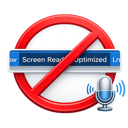

# Auto Disable Screen Reader VS Code Extension

> [!WARNING]
> **This extension is obsolete and deprecated.** As of [microsoft/vscode#297125](https://github.com/microsoft/vscode/pull/297125), VS Code natively handles this issue and no longer incorrectly enables "Screen Reader Optimized" mode for tools like Wispr Flow. You can safely uninstall this extension and update VS Code to the latest version.

> [!NOTE]
> This project was AI-generated by **Maxim Mazurok** using **Google Antigravity with Gemini 3 Flash**.

This extension automatically ensures that `editor.accessibilitySupport` is set to `off` in your VS Code settings. This is useful when using tools like Wispr Flow that might trigger VS Code's "Screen Reader Optimized" mode, which can interfere with keyboard shortcuts (e.g., accepting Copilot suggestions).

## Features

- **Auto-Disable**: Automatically reverts `editor.accessibilitySupport` to `off` whenever it changes.
- **Polling Fallback**: (Optional) Periodically checks the setting to ensure it stays disabled.
- **Configurable**: You can enable/disable the extension or adjust the polling interval.

## Installation

### From VS Code Marketplace (Recommended)
Install directly from the [VS Code Marketplace](https://marketplace.visualstudio.com/items?itemName=MaximMazurok.vscode-dictation-auto-disable-screen-reader):
1. In VS Code, go to the **Extensions** view (`Cmd+Shift+X`).
2. Search for "Auto Disable Screen Reader" or "MaximMazurok.vscode-dictation-auto-disable-screen-reader".
3. Click **Install**.

Alternatively, you can [click here](https://marketplace.visualstudio.com/items?itemName=MaximMazurok.vscode-dictation-auto-disable-screen-reader) to open the extension page and click the **Install** button.

### From Open VSX Registry
For VS Code compatible editors like VSCodium, install from [Open VSX](https://open-vsx.org/extension/MaximMazurok/vscode-dictation-auto-disable-screen-reader):
1. In your editor, go to the **Extensions** view.
2. Search for "Auto Disable Screen Reader" or "MaximMazurok.vscode-dictation-auto-disable-screen-reader".
3. Click **Install**.

### From GitHub Releases
You can also download the latest `.vsix` file from the [Releases](https://github.com/Maxim-Mazurok/vscode-dictation-auto-disable-screen-reader-plugin/releases) page and install it manually:
1. In VS Code, go to the **Extensions** view (`Cmd+Shift+X`).
2. Click the **...** (Views and More Actions) menu in the top right.
3. Select **Install from VSIX...**.
4. Choose the downloaded `.vsix` file.

## Configuration

- `autoDisableScreenReader.enabled`: Enable or disable the auto-disabling logic.
- `autoDisableScreenReader.enablePolling`: Enable polling as a fallback (default: `false`).
- `autoDisableScreenReader.pollingInterval`: Interval in milliseconds (default: `500ms`).

---

## Developer Information
If you want to build the extension from source or contribute, please see [CONTRIBUTING.md](./CONTRIBUTING.md).

## License
[MIT](./LICENSE)
